<!-- Generated by scripts/build.py. To change anything, edit profile.toml instead of this file. -->


  

&nbsp;&nbsp;
<a href="https://x.com/imsurya1875">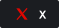</a>
&nbsp;&nbsp;

 


<a href="https://f1intel.in"></a>
<a href="https://github.com/user-is-surya/NEXUS---weather-analyser-forecaster-and-predictor"></a>

 


 

 

 

 


 



 

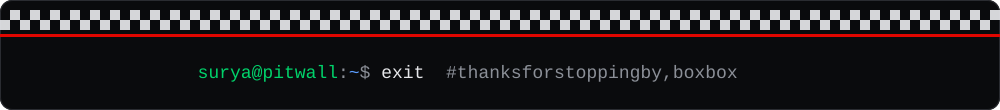
